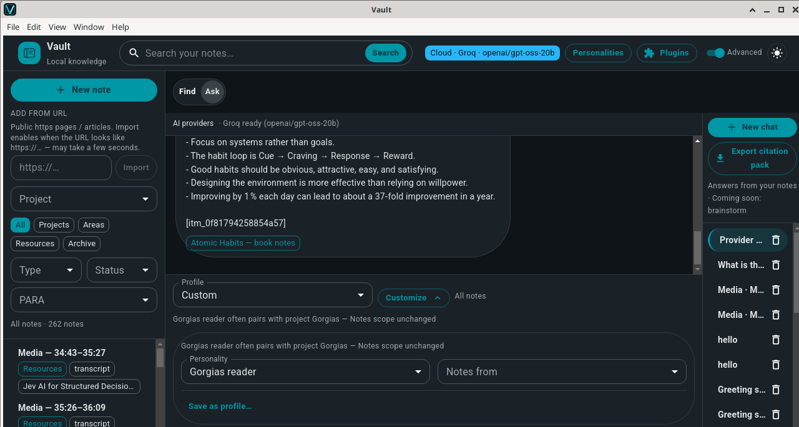
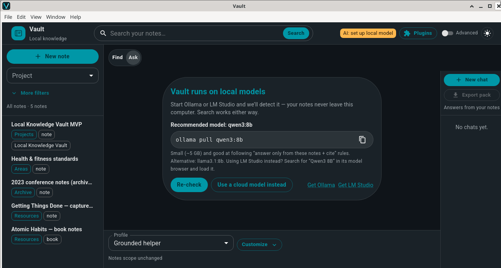
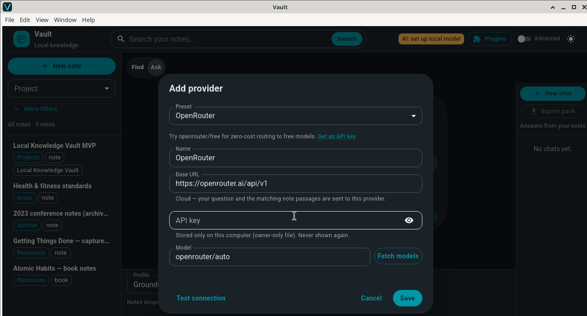
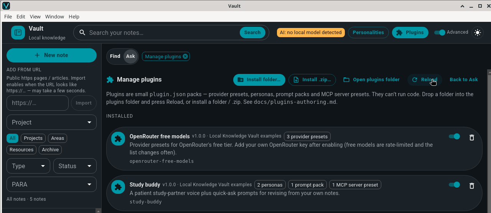
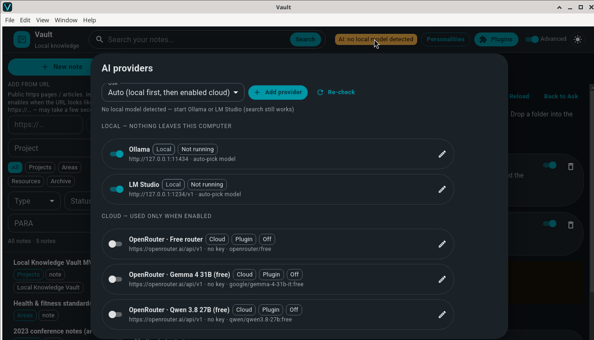

# Vault

[](https://app.codecov.io/gh/tosin2013/local-knowledge-vault)

**Chat with your notes on your own computer. Every answer cites the note it came from, or says it doesn't know.**

Vault (Local Knowledge Vault) is a desktop app for macOS, Windows and Linux. Your notes stay in a
local SQLite database. Answers come from a local model by default (Ollama or LM Studio, detected
automatically), and you can add a cloud provider or a shareable plugin in a few clicks.

<!-- DEMO: replace docs/media/vault-demo.gif after recording -->
<!-- After recording, replace the <p> below with:
<p align="center"><a href="docs/media/vault-demo.mp4"></a></p>
-->
<p align="center">
  
  <br>
  <sub>An answer with its citation badge. (This still used a cloud provider; new installs use a local model first.)</sub>
</p>

## Download

Installers will be published on the
**[Releases page](https://github.com/tosin2013/local-knowledge-vault/releases)**: `.dmg`/`.zip`
for macOS, an NSIS `.exe` for Windows, and `.AppImage`/`.deb`/`.rpm`/`.snap` for Linux. Until the
first release is up, [build from source](#build-from-source).

**Linux:** on Ubuntu/Debian run `sudo apt install ./local-knowledge-vault_*_amd64.deb`; on Fedora run
`sudo dnf install ./local-knowledge-vault-*.x86_64.rpm`. The snap is confined, so **Media chat** can't reach a
`yt-dlp` installed outside it; use the `.deb`, `.rpm` or AppImage if you need YouTube import.

**macOS: the app is not notarized yet.** The first time you open it, macOS says it can't verify
the app. Click **Done**, then go to **System Settings → Privacy & Security**, click **Open Anyway**
and confirm. You only need to do this once. On macOS 14 and earlier, right-click (or Control-click)
**Vault.app** → **Open** → **Open** also works.

If macOS says Vault "is damaged and can't be opened", remove the download quarantine flag and open
it again: `xattr -dr com.apple.quarantine /Applications/Vault.app`.

## Quick start (local first)

1. Install [Ollama](https://ollama.com) or [LM Studio](https://lmstudio.ai).
2. Pull the recommended model:
   ```bash
   ollama pull qwen3:8b
   ```
   (about 5 GB; `llama3.1:8b` also works. In LM Studio, search for "Qwen3 8B" and load it.)
3. Open Vault. The header chip should read **`Local · Ollama · qwen3:8b`**. If no model is
   running, Vault shows a setup card with the command above and a **Re-check** button.
4. Add notes: **New note**, or turn on **Advanced** and paste a link into **Add from URL**.
   First launch also seeds a self-documenting **Vault guide** project so you can try it straight away.
5. Open **Ask** and ask a question. Click a citation badge to open the source note.

Prefer a cloud model? Click the AI chip → **Add provider**, pick a preset, paste your key, press
**Test connection**, then **Save**.

## Why Vault

- **Answers you can check.** Answers cite the notes they came from as clickable `itm_` badges.
  Citations to notes that weren't retrieved are dropped before you see them, and when your notes
  don't cover a question, Vault says so.
- **Local by default.** Notes live in SQLite on your machine. With Ollama or LM Studio, nothing
  leaves your computer. Search works with no model and no network at all.
- **Any model you like.** Local models first, or OpenAI, Anthropic, Gemini, OpenRouter, Mistral,
  DeepSeek, Together, Groq, xAI, or any OpenAI-compatible URL.
- **Plugins you can share safely.** A plugin is a `plugin.json` folder or zip. It adds presets,
  voices and prompt packs, and it cannot run code.
- **Low ceremony.** Ask is the home screen. Simple mode hides the knobs; Advanced shows them.

## Features

### Ask with citations

Vault searches your notes, sends the matching passages to the model with fixed grounding rules,
and shows each cited note as a badge. Clicking a badge opens the note in a side peek, so your chat
stays where it is. If search finds nothing, you get "I couldn't find that in your notes" without a
model call. Chats are saved as sessions, and **Export citation pack** writes the thread, the cited
notes and a manifest to a folder or zip that you can hand to another LLM or a colleague.

### Local model setup that explains itself



With no model running, the first-run card recommends `qwen3:8b` and offers **Re-check** or
**Use a cloud model instead**. If you are running a very small model (under ~3B parameters),
Vault suggests a bigger one, because small models follow citation rules less reliably.

### Add your own provider



Pick a preset or a custom OpenAI-compatible URL, fetch the live model list, and test the
connection before saving. Keys are write-only in the UI and stored in owner-only files.

### Declarative plugins



**Plugins → Manage plugins** installs a folder or `.zip`, shows what each pack contributes, and
explains why a broken pack was rejected.

### More

- **Media chat.** Paste a YouTube URL (captions fetched with [`yt-dlp`](https://github.com/yt-dlp/yt-dlp),
  which must be installed; `pipx install "yt-dlp[default,curl-cffi]"` includes the browser
  impersonation that avoids YouTube 429 errors) or open a local video/audio file with its `.srt`/`.vtt` captions. Captions
  become timed transcript notes you can ask about. With local media, clicking a citation seeks the
  player; YouTube embeds show the timestamp instead. Player and chat can go fullscreen together.
- **Media voices.** Reusable voices (Desk cohost, Curious student, Skeptical investor, or your
  own) that change the speaking style but keep the same grounding rules. One install works for
  every video.
- **Personalities and profiles** for Ask, plus note groups (Projects / Areas / Resources /
  Archives), kinds, status and project filters.
- **Add from URL.** Fetches a public web page, extracts the text and auto-tags it as a note
  (Advanced mode).
- **MCP client.** **Plugins → MCP connections → Connect Notion** signs in to Notion's hosted MCP
  server (`https://mcp.notion.com/mcp`) with OAuth and lists its tools. You can also add other
  Streamable HTTP MCP servers. Using MCP tools inside Ask is not wired up yet.
- **Obsidian bridge.** While Vault runs, it serves a small HTTP API on `127.0.0.1:8765`
  (`/health`, `/v1/projects`, `/v1/ask`). A scaffold Obsidian plugin in
  [`bridges/obsidian-vault/`](bridges/obsidian-vault/) adds an **Ask Vault…** command that inserts
  the cited answer into your current note. See [docs/bridges.md](docs/bridges.md).
- **Simple and Advanced modes**, light and dark themes.

Retrieval is local keyword search (SQLite FTS5 with BM25 ranking). There are no embeddings, so
short, focused notes and questions that reuse their words work best.

## Bring any model

| Preset | Default model | Key |
|---|---|---|
| Ollama (local) | auto-picks an installed model | none |
| LM Studio (local) | the loaded model | none |
| OpenAI | `gpt-4o-mini` | required |
| Anthropic | `claude-haiku-4-5` | required |
| Google Gemini | `gemini-3.8-flash` | required |
| OpenRouter | `openrouter/auto` (`openrouter/free` for free models) | required |
| Mistral | `mistral-small-latest` | required |
| DeepSeek | `deepseek-flash` | required |
| Together | `meta-llama/Llama-3.3-70B-Instruct-Turbo` | required |
| Groq | `openai/gpt-oss-20b` | required |
| xAI | `grok-4.3` | required |
| Custom | any OpenAI-compatible server (vLLM, llama.cpp server, LocalAI, Jan, gateways) | optional |

In **Auto (local first)** mode Vault tries Ollama, then LM Studio, then other local servers, then
enabled cloud providers that have a key. A disabled cloud provider is never called. Model defaults
change often, so use **Fetch models** to pick from the provider's live list. Details, key storage
and environment variables: **[docs/providers.md](docs/providers.md)**.



## Plugins

A plugin is a folder with a `plugin.json` (plus optional Markdown and image files). It can add
provider presets, voices, quick-ask prompt packs and MCP server presets. It cannot run code, and
it cannot ship API keys or custom headers.

```json
{
  "schemaVersion": 1,
  "id": "study-buddy",
  "name": "Study buddy",
  "version": "1.0.0",
  "contributes": {
    "personas": [
      { "name": "Study buddy", "prompt": "Explain simply, then ask one quiz question from my notes." }
    ],
    "promptPacks": [
      { "name": "Revision", "prompts": ["Quiz me: ask 3 questions I should be able to answer from these notes."] }
    ]
  }
}
```

Install it from **Plugins → Manage plugins → Install folder…** (or **Install .zip…**). Full
reference: **[docs/plugins-authoring.md](docs/plugins-authoring.md)**. Examples:
[`examples/plugins/`](examples/plugins/). Built-in panels are documented in
[PLUGINS.md](PLUGINS.md).

## How it compares

|  | Vault | Obsidian + AI community plugins | Notion AI | AnythingLLM |
|---|---|---|---|---|
| Where your notes live | SQLite on your computer | Markdown files on your device | Notion's cloud workspace | On your computer (desktop) or your own server |
| AI | Built in: grounded Ask over your notes | Through community plugins; behavior varies by plugin | Built in (Business/Enterprise plans; limited trial on Free/Plus) | Built in: chat with documents, agents |
| Models | Local first (Ollama, LM Studio), or add a cloud provider | Depends on the plugin | Models Notion offers, via its model picker | Local on-device models, with model selection |
| Best at | Cited answers from personal notes and video captions, one user | Flexible linked notes, thousands of plugins, sync and publish | Team docs, databases and collaboration | A broad local AI workspace, including multi-user self-hosting |

Where Vault is weaker today: no semantic (embedding) search, single user, no mobile app, no sync,
and a much smaller plugin ecosystem. Obsidian and Vault can work together through the bridge.

## Privacy

Your data lives in Vault's user-data folder:

| OS | Folder |
|---|---|
| macOS | `~/Library/Application Support/local-knowledge-vault` |
| Windows | `%APPDATA%\local-knowledge-vault` |
| Linux | `~/.config/local-knowledge-vault` |

It holds the notes database (`lkv.sqlite`), provider settings (`lkv-providers.json`), API keys
(`lkv-keys/`, encrypted with the OS keychain via `safeStorage`, falling back to owner-only files)
and plugins (`plugins/`). Set `LKV_USER_DATA_DIR` to use another folder.

What leaves your machine:

- **With a local model: nothing.** Health checks only ping local servers.
- **With a cloud provider you enabled:** your question, the matching note passages and recent chat
  turns go to that provider only. Cloud providers are not contacted until you ask something.
- **Add from URL** fetches the page you give it. Vault asks the active model to auto-tag it, so if
  that is a cloud provider it receives an excerpt of the page.
- **Media chat** contacts YouTube (through `yt-dlp` and the embedded player) only for YouTube media.
- **Notion** is contacted only if you connect it under MCP connections.
- The Obsidian bridge listens on `127.0.0.1` only and requires a per-install bearer token (shown
  in **AI providers → Vault Bridge**). Do not expose or port-forward that port.

## Build from source

Requires Node.js and npm. `better-sqlite3` is a native module; on Linux you may need `python3`,
`make` and `g++`.

```bash
git clone https://github.com/tosin2013/local-knowledge-vault.git
cd local-knowledge-vault
npm install          # also rebuilds better-sqlite3 for Electron
npm run dev          # Electron + Vite with hot reload
```

Checks (no GUI needed):

```bash
npm run typecheck
npm run test:mvp            # database, search, citation validation
npm run test:providers      # provider registry, adapters, plugin loader (offline)
npm run test:media          # caption parsing and chunking
npm run test:citation-pack  # citation pack export
```

Installers:

```bash
npm run dist:mac     # dmg + zip (on macOS)
npm run dist:win     # NSIS installer (on Windows)
npm run dist:linux   # AppImage + deb + rpm + snap (on Linux)
```

More (layout, IPC API, environment variables, all test scripts):
**[docs/development.md](docs/development.md)**. Releases: [docs/release.md](docs/release.md).

## Roadmap

- **Vault as an MCP server**, so AI agents can use your notes as cited memory.
- **Signed and notarized macOS builds.**
- **A starter sample vault** for a better first run.
- **Code plugins** later, behind a permission model. Plugins stay declarative for now.

## Contributing

Issues and pull requests are welcome. Please include your OS, the model or provider you used, and
steps to reproduce. Before opening a PR, run `npm run typecheck` and the relevant `npm run test:*`
scripts. For plugin ideas, start with a `plugin.json` pack; see
[docs/plugins-authoring.md](docs/plugins-authoring.md).

## License

Vault is licensed under the [Apache License 2.0](LICENSE). See [NOTICE](NOTICE) for attributions.

Built by Tosin Akinosho ([@tosin2013](https://github.com/tosin2013)).
